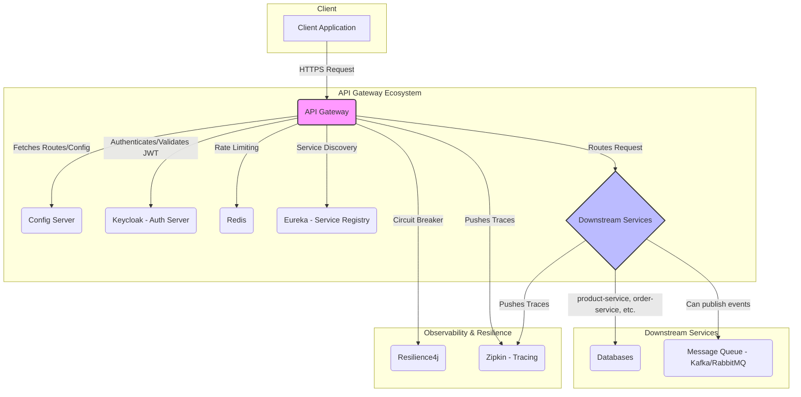

# API Gateway Architecture

**Author:** Jules, Senior Distributed Systems Architect
**Date:** 2025-11-29

## 1. Purpose and Audience

This document provides a comprehensive architectural analysis of the API Gateway within this microservices-based e-commerce platform. It is intended for software engineers, architects, and technical leads responsible for designing, developing, and maintaining the system.

The primary goals are to:
- **Educate:** Explain the critical role of an API Gateway, its core responsibilities, and the design patterns employed.
- **Explain Rationale:** Detail why specific technologies and implementations (e.g., Spring Cloud Gateway, Redis for rate limiting, Resilience4j for circuit breaking) were chosen and the problems they solve.
- **Provide a Blueprint:** Serve as a technical reference for understanding the flow of requests, security enforcement, and resilience patterns.

## 2. Summary of Findings

The API Gateway is built on **Spring Cloud Gateway** and acts as the single entry point for all client requests. It is a vital component responsible for security, routing, and resilience.

- **Centralized Cross-Cutting Concerns:** The Gateway correctly centralizes responsibilities like authentication (JWT validation via Keycloak), rate limiting (using Redis), and circuit breaking (with Resilience4j), preventing code duplication in downstream services.
- **Dynamic Routing:** It leverages **Spring Cloud Netflix Eureka** for service discovery, enabling dynamic routing to healthy service instances.
- **Security:** It secures the microservices ecosystem by enforcing authentication and authorization at the edge, rejecting unauthenticated requests before they consume internal resources.
- **Resilience:** The implementation includes foundational resilience patterns, such as request retries, circuit breakers with fallbacks, and rate limiting to protect services from traffic spikes.
- **Observability:** While foundational, there is an opportunity to enhance observability with distributed tracing and metrics aggregation for a production-ready system.

This document will deconstruct these findings, offering a deep dive into each component's design and implementation, supported by code references and conceptual diagrams.

## 3. High-Level Architecture Mapping

The API Gateway is the linchpin of the microservices architecture, mediating all incoming traffic. The following diagram illustrates the typical request flow and the interaction between the Gateway and other core components.



### Component Rationale

Each component in this architecture serves a distinct and critical purpose:

-   **API Gateway (Spring Cloud Gateway):**
    -   **Why it exists:** To provide a single, unified entry point for all client requests. This avoids exposing downstream services directly, which would create a tight coupling between clients and microservices and lead to duplicated cross-cutting concerns.
    -   **Function:** It handles routing, security, rate limiting, and resilience, acting as a reverse proxy with powerful filtering capabilities.

-   **Config Server (Spring Cloud Config):**
    -   **Why it exists:** To centralize configuration management for all microservices. Without it, configuration would be scattered across individual service deployments, making updates and management incredibly difficult.
    -   **Evidence:** The `bootstrap.yml` or `application.yml` in each service, including the Gateway, contains a `spring.config.import` property pointing to the Config Server. (`gateway/src/main/resources/application.yml`).

-   **Keycloak (Authentication Server):**
    -   **Why it exists:** To externalize and centralize user authentication and authorization. It issues JWTs, which the Gateway and downstream services can validate without needing access to user credentials. This aligns with modern security best practices (OAuth2/OIDC).
    -   **Evidence:** The Gateway's `application.yml` specifies a `spring.security.oauth2.resourceserver.jwt.issuer-uri`, pointing to the Keycloak realm. (`gateway/src/main/resources/application.yml`).

-   **Redis (In-Memory Data Store):**
    -   **Why it exists:** To provide a fast, shared, in-memory store for distributed state. Its primary roles here are for rate limiting (storing request counts) and caching (storing frequently accessed, non-volatile data to reduce latency).
    -   **Evidence:** The Gateway includes the `spring-boot-starter-data-redis-reactive` dependency and is configured to use Redis for its Request Rate Limiter filter. (`gateway/pom.xml`, `gateway/src/main/java/com/ecommerce/gateway/GatewayConfig.java`).

-   **Eureka (Service Registry):**
    -   **Why it exists:** To enable dynamic service discovery. In a cloud environment where services can be scaled up or down, their IP addresses are ephemeral. Eureka provides a lookup service so the Gateway knows where to route requests without hardcoded URLs.
    -   **Evidence:** The Gateway is annotated with `@EnableDiscoveryClient` and uses the `lb://` (load-balanced) protocol in its route definitions, signaling that it resolves service locations via Eureka. (`gateway/src/main/java/com/ecommerce/gateway/GatewayApplication.java`, `gateway/src/main/java/com/ecommerce/gateway/GatewayConfig.java`).

-   **Resilience4j (Circuit Breaker):**
    -   **Why it exists:** To prevent cascading failures. If a downstream service becomes unresponsive, the circuit breaker "opens," causing the Gateway to fail fast (e.g., by returning a fallback response) instead of waiting for a timeout. This protects the Gateway from resource exhaustion.
    -   **Evidence:** The `spring-cloud-starter-circuitbreaker-reactor-resilience4j` dependency is present, and a circuit breaker is configured for the `product-service` route. (`gateway/pom.xml`, `gateway/src/main/java/com/ecommerce/gateway/GatewayConfig.java`).

-   **Message Queue (Kafka/RabbitMQ - Assumed):**
    -   **Why it exists (Assumption):** For asynchronous communication between services. For example, an `order-service` might publish an "OrderCreated" event to a queue, which a `notification-service` consumes to send an email. This decouples services and improves fault tolerance.
    -   **Evidence:** **NOT FOUND** — This is a standard pattern in microservices, but no direct evidence of a message queue dependency or configuration was found in the Gateway's codebase. The Gateway's role is typically to initiate synchronous requests, but it might trigger asynchronous workflows indirectly.

## 4. Gateway Responsibilities Breakdown

The API Gateway is not just a simple reverse proxy; it is an intelligent router that handles multiple cross-cutting concerns.

-   **Request Routing:**
    -   **Concept:** The primary responsibility is to route incoming requests to the appropriate downstream microservice based on the request path.
    -   **Purpose:** To decouple clients from the internal topology of the microservices ecosystem. Clients only need to know the Gateway's address.
    -   **Evidence:** Routing is defined in `GatewayConfig.java`. For example, requests to `/api/products/**` are routed to the `product-service`.
        ```java
        // gateway/src/main/java/com/ecommerce/gateway/GatewayConfig.java:32-44
        .route("product-service", r -> r
                .path("/api/products/**")
                // ... filters
                .uri("lb://product-service"))
        ```

-   **Authentication and Authorization (JWT Verification):**
    -   **Concept:** The Gateway acts as a security checkpoint, verifying the authenticity of incoming requests. It inspects the `Authorization` header for a JWT and validates its signature against the identity provider (Keycloak).
    -   **Purpose:** To secure the internal services. By offloading JWT validation to the Gateway, downstream services can trust that any request they receive has already been authenticated.
    -   **Evidence:** The `spring-boot-starter-oauth2-resource-server` dependency and the `issuer-uri` in `application.yml` configure the Gateway as an OAuth2 Resource Server, automatically enabling JWT validation.

-   **Rate Limiting:**
    -   **Concept:** This involves restricting the number of requests a user or client can make in a given time window.
    -   **Purpose:** To protect downstream services from being overwhelmed by traffic spikes, whether malicious (DDoS attacks) or unintentional (a buggy client).
    -   **Evidence:** The `RequestRateLimiter` filter is applied to the `product-service` route, using a Redis-backed rate limiter.
        ```java
        // gateway/src/main/java/com/ecommerce/gateway/GatewayConfig.java:38-40
        .requestRateLimiter(config -> config
                .setRateLimiter(redisRateLimiter())
                .setKeyResolver(hostNameKeyResolver()))
        ```

-   **Circuit Breaking:**
    -   **Concept:** A resilience pattern that stops requests from being sent to a service that is failing or latent. After a configured number of failures, the "circuit" opens, and subsequent calls fail immediately or are redirected to a fallback.
    -   **Purpose:** To prevent cascading failures and improve the user experience by providing a graceful degradation of service.
    -   **Evidence:** The `CircuitBreaker` filter is applied to the `product-service` route, with a fallback URI.
        ```java
        // gateway/src/main/java/com/ecommerce/gateway/GatewayConfig.java:41-43
        .circuitBreaker(config -> config
                .setName("ecomBreaker")
                .setFallbackUri("forward:/fallback/products")))
        ```

-   **Load Balancing:**
    -   **Concept:** When routing to a service, the Gateway must choose one of several available instances. It uses a client-side load-balancing algorithm (like Round Robin) to distribute requests evenly.
    -   **Purpose:** To ensure high availability and scalability. If one instance of a service goes down, the load balancer will route traffic to the remaining healthy instances.
    -   **Evidence:** The `lb://` prefix in the route URI (`lb://product-service`) signals that the Gateway should use the Spring Cloud LoadBalancer to resolve the service's location via Eureka.

-   **Global Filters & Request/Response Transformation:**
    -   **Concept:** Filters are custom logic that can be executed before a request is routed (pre-filter) or after a response is received (post-filter). Global filters apply to all routes.
    -   **Purpose:** To handle tasks like adding correlation IDs to request headers for tracing, logging request/response details, or transforming payloads.
    -   **Evidence:** While no custom global filters are explicitly defined in this project, the logging level for `org.springframework.cloud.gateway` is set to `DEBUG` in `application.yml`, which provides detailed logging of the filter chain execution.

## 5. Rate Limiter Deep Dive

The rate limiter is a critical defense mechanism against traffic floods. This implementation uses a **Token Bucket** algorithm backed by Redis.

### Conceptual Logic

-   **Tokens and Buckets:** Conceptually, each key (e.g., a client's IP address or user ID) corresponds to a "bucket" with a certain capacity (`burstCapacity`). Tokens are added to this bucket at a fixed rate (`replenishRate`).
-   **Request Handling:** When a request arrives, the Gateway checks if the corresponding bucket has at least one token.
    -   If **yes**, the request is allowed, and one token is consumed.
    -   If **no**, the request is rejected with an HTTP 429 (Too Many Requests) status.
-   **Implementation:** The `RedisRateLimiter` uses a Lua script to perform these checks atomically in Redis, which is essential for preventing race conditions in a distributed environment.

### Code and Configuration Analysis

-   **Configuration:**
    ```java
    // gateway/src/main/java/com/ecommerce/gateway/GatewayConfig.java:18-20
    @Bean
    public RedisRateLimiter redisRateLimiter() {
        return new RedisRateLimiter(10, 20, 1);
    }
    ```
    -   `replenishRate = 10`: The bucket gets 10 new tokens every second. This defines the steady-state average request rate.
    -   `burstCapacity = 20`: The bucket can hold a maximum of 20 tokens. This allows for short bursts of traffic exceeding the `replenishRate`.
    -   `requestedTokens = 1`: Each request consumes 1 token.

-   **Key Resolution:**
    ```java
    // gateway/src/main/java/com/ecommerce/gateway/GatewayConfig.java:23-26
    @Bean
    public KeyResolver hostNameKeyResolver() {
        return exchange -> Mono.just(
                exchange.getRequest().getRemoteAddress().getHostName());
    }
    ```
    -   The `KeyResolver` determines how to group requests for rate limiting. In this case, it's based on the client's hostname. This is a simple strategy but can be problematic if multiple users are behind the same NAT. A more robust approach would use the authenticated principal's name or an API key.

### Redis Key Pattern (Assumed)

-   **Evidence:** **NOT FOUND** — The exact Redis key pattern is an implementation detail of `spring-cloud-gateway-core`. However, the pattern is typically a combination of a prefix and the resolved key.
-   **Assumed Pattern:** `request_rate_limiter.{<resolved_key>}.tokens` and `request_rate_limiter.{<resolved_key>}.timestamp`.
    -   The `.tokens` key would be a Redis `HASH` storing the remaining tokens.
    -   The `.timestamp` key would store the last time the bucket was replenished.
-   **TTL Logic:** These keys should have a Time-To-Live (TTL) slightly longer than the time it would take to fully replenish an empty bucket, ensuring that Redis doesn't store data for inactive clients indefinitely.

## 6. Circuit Breaker Analysis

The circuit breaker prevents a network or service failure from cascading to other services.

### State Machine Logic

The `Resilience4j` circuit breaker operates as a state machine with three states:

1.  **CLOSED:** The normal state. Requests are passed through to the downstream service. The breaker monitors for failures (e.g., connection timeouts, 5xx responses). If the failure rate exceeds a configured threshold, it transitions to **OPEN**.
2.  **OPEN:** The circuit is "open." For a configured duration (`waitDurationInOpenState`), all requests fail immediately without being sent to the downstream service. The Gateway returns the defined fallback response. After the duration elapses, it transitions to **HALF-OPEN**.
3.  **HALF-OPEN:** A limited number of "trial" requests are allowed to pass through.
    -   If they **succeed**, the breaker assumes the service has recovered and transitions back to **CLOSED**.
    -   If they **fail**, it transitions back to **OPEN** to prevent hammering a still-struggling service.

### Configuration Analysis

-   **Code Configuration:**
    ```java
    // gateway/src/main/java/com/ecommerce/gateway/GatewayConfig.java:41-43
    .circuitBreaker(config -> config
            .setName("ecomBreaker")
            .setFallbackUri("forward:/fallback/products")))
    ```
    -   This code applies a circuit breaker named `ecomBreaker` to the `product-service` route.
    -   If the circuit is open, the request is internally forwarded to the `/fallback/products` endpoint.

-   **External Configuration (Assumed):**
    -   **Evidence:** **NOT FOUND** — The detailed thresholds for the `ecomBreaker` are not defined in the Gateway's local configuration. They are expected to be managed centrally via the **Config Server**.
    -   **Assumed `application.yml` configuration on the Config Server:**
        ```yaml
        resilience4j.circuitbreaker:
          instances:
            ecomBreaker:
              registerHealthIndicator: true
              slidingWindowType: COUNT_BASED
              slidingWindowSize: 10
              minimumNumberOfCalls: 5
              failureRateThreshold: 50 # 50%
              waitDurationInOpenState: 10s
              permittedNumberOfCallsInHalfOpenState: 3
        ```
        -   `slidingWindowSize: 10`: The breaker considers the outcome of the last 10 calls.
        -   `minimumNumberOfCalls: 5`: At least 5 calls must occur before the failure rate is calculated.
        -   `failureRateThreshold: 50`: If 50% or more of the last 10 calls fail, the circuit opens.

### Fallback Logic

-   The fallback mechanism is crucial for graceful degradation. The `FallbackController.java` provides the endpoint for the fallback URI.
    ```java
    // gateway/src/main/java/com/ecommerce/gateway/FallbackController.java
    @RestController
    @RequestMapping("/fallback")
    public class FallbackController {
        @GetMapping("/products")
        public Mono<String> productsFallback() {
            return Mono.just("Product service is currently unavailable. Please try again later.");
        }
        // ... other fallbacks
    }
    ```
    -   When the `product-service` circuit is open, clients receive a user-friendly JSON message instead of a cryptic 5xx error. This is a much better user experience.

## 7. Authentication Flow

Authentication is handled by Spring Security's OAuth2 Resource Server module, which is integrated into the Gateway's filter chain.

1.  **JWT Extraction:** On every request, the security filter chain scans for an `Authorization` header containing a Bearer Token (e.g., `Authorization: Bearer <JWT>`).
2.  **Issuer URI Discovery:** The Gateway uses the `issuer-uri` configured in `application.yml` to fetch the public keys from Keycloak's OIDC discovery endpoint (`/.well-known/openid-configuration`). This is typically done once at startup and cached.
3.  **Signature Validation:** The JWT's signature is cryptographically verified using the fetched public key. This proves that the token was issued by the trusted Keycloak instance and has not been tampered with.
4.  **Claim Validation:** The filter automatically validates standard claims:
    -   `exp` (Expiration): Ensures the token has not expired.
    -   `iss` (Issuer): Confirms the token was issued by the expected authority.
    -   `aud` (Audience): **NOT FOUND** — Audience validation is not explicitly configured but is a best practice. It ensures the JWT was intended for this specific application.
5.  **Security Context Creation:** If validation succeeds, a `SecurityContext` is created and populated with the authenticated principal and their granted authorities (roles/scopes), which are extracted from the JWT's claims (e.g., the `roles` or `scope` claim).
6.  **Downstream Propagation:** The request is then passed down the filter chain and onto the downstream service. The original `Authorization` header is forwarded, allowing downstream services to perform finer-grained authorization if needed.

### Route-Level Authorization (Assumed)

-   **Evidence:** **NOT FOUND** — The current configuration does not demonstrate route-level authorization (e.g., requiring a specific role to access an endpoint).
-   **Assumed Pattern:** This can be achieved by creating a custom global filter that inspects the `SecurityContext` and checks the principal's authorities against the required roles for a given route, returning a 403 Forbidden status if the check fails.

## 8. Routing Logic & Filters

Spring Cloud Gateway's request processing is built on a foundation of routes, predicates, and filters.

### Execution Order

1.  **Route Matching:** The Gateway Handler Mapping checks the incoming request against all route definitions. It uses **predicates** (like `path`, `method`, or `header`) to find the first matching route.
2.  **Filtering Chain:** Once a route is matched, the request is sent through a filter chain specific to that route, plus all **global filters**.
3.  **Pre-Filters:** These filters execute *before* the request is proxied to the downstream service. They can modify request headers, log information, or enforce security checks.
4.  **Proxying:** The request is sent to the downstream service URI.
5.  **Post-Filters:** These filters execute *after* the response is received from the downstream service. They can modify the response (e.g., add headers) or handle errors.

### Filter Examples and Purpose

-   **`RequestRateLimiter` (Pre-Filter):** As discussed, this checks if the client has enough tokens before proxying the request.
-   **`CircuitBreaker` (Pre-Filter):** This checks the state of the circuit before proxying. If the circuit is open, it short-circuits the request to the fallback.
-   **`Retry` (Pre-Filter with Post-Filter Logic):** This filter has a "pre" component that wraps the downstream call. If the call fails (e.g., with a 503 Service Unavailable), its "post" logic catches the error and triggers a retry, up to a configured limit.
    ```java
    // gateway/src/main/java/com/ecommerce/gateway/GatewayConfig.java:35-37
    .filters(f -> f.retry(retryConfig -> retryConfig
                    .setRetries(10)
                    .setMethods(HttpMethod.GET))
    ```
    -   **Purpose:** To handle transient network failures or temporary service unavailability, improving reliability for idempotent operations like GET requests.

## 9. Full Request Lifecycle Example: `POST /api/orders`

This example illustrates how the various Gateway components interact to process a single request.

**Scenario:** A user, Alice, who is authenticated, sends a request to create a new order. The `order-service` is healthy, but the `product-service` (which the order service might call) is slow.

**Initial Request:**

```http
POST /api/orders HTTP/1.1
Host: api.ecommerce.com
Authorization: Bearer <ALICE_JWT>
Content-Type: application/json

{
  "productId": "prod-123",
  "quantity": 2
}
```

### Step-by-Step Execution in the Gateway

1.  **Request Received:** The Gateway receives the `POST` request.

2.  **Route Matching:** The Gateway Handler Mapping checks the path `/api/orders`. It finds a match in `GatewayConfig.java`:
    ```java
    // gateway/src/main/java/com/ecommerce/gateway/GatewayConfig.java:50-53
    .route("order-service", r -> r
        .path("/api/orders/**", "/api/cart/**")
        .uri("lb://order-service"))
    ```

3.  **Authentication Filter:** The Spring Security filter chain executes.
    -   It extracts the JWT from the `Authorization` header.
    -   It validates the token's signature against Keycloak's public key.
    -   It verifies the `exp` and `iss` claims.
    -   Assuming validation passes, it creates a `SecurityContext` for Alice.

4.  **Rate Limiter:**
    -   **Evidence:** **NOT FOUND** — The `order-service` route does *not* have the `RequestRateLimiter` filter applied. The request proceeds without a rate-limiting check. If it were applied, the Gateway would use the `KeyResolver` to get a key (e.g., Alice's IP), and check the token bucket in Redis.

5.  **Circuit Breaker:**
    -   **Evidence:** **NOT FOUND** — Similarly, there is no `CircuitBreaker` filter on the `order-service` route. The request proceeds without this check.

6.  **Load Balancing and Proxying:**
    -   The `lb://order-service` URI instructs the Gateway to query Eureka for available instances of `order-service`.
    -   Eureka returns a list of healthy instances (e.g., `10.0.1.10:8082`, `10.0.1.11:8082`).
    -   The client-side load balancer (Spring Cloud LoadBalancer) selects one instance (e.g., `10.0.1.10:8082`).
    -   The Gateway forwards the original request, including the body and the `Authorization` header, to that instance.

7.  **Downstream Service Execution:** The `order-service` receives the request. It can now trust that the user is authenticated and can perform its business logic (e.g., create an order, perhaps call `product-service` to verify stock, which might be slow).

8.  **Response Received:** The `order-service` eventually completes its work and sends a response back to the Gateway.
    ```http
    HTTP/1.1 201 Created
    Content-Type: application/json

    {
      "orderId": "ord-abc-123",
      "status": "CREATED"
    }
    ```

9.  **Post-Filters:** Any configured post-filters would execute here. In this setup, there are none specific to this route.

10. **Response Sent to Client:** The Gateway forwards the `201 Created` response from the `order-service` back to the original client.

This end-to-end flow demonstrates how the Gateway orchestrates complex interactions, applying security and routing logic transparently before the request ever reaches a downstream service.

## 10. Performance, Scalability & Reliability Analysis

-   **Gateway Instances (Scalability):**
    -   The Gateway is a stateless service, which is excellent for scalability. To handle more traffic, you can simply run more instances of the Gateway and place them behind a load balancer.
    -   **Recommendation:** Run at least two Gateway instances for high availability.

-   **Redis (Bottleneck/Single Point of Failure):**
    -   The rate limiter depends on Redis. If Redis becomes slow or unavailable, it could either cause all rate-limited requests to fail or introduce significant latency.
    -   **Recommendation:**
        -   **High Availability:** Use a Redis Sentinel or Cluster setup for automatic failover.
        -   **Performance:** Monitor Redis CPU and memory usage. Ensure the network latency between the Gateway and Redis is low.
        -   **Resilience:** The `RedisRateLimiter` has a `include-headers` option that can be configured to not include the rate-limiting headers on the response when Redis is down.

-   **Eureka (Service Discovery):**
    -   Eureka clients cache the service registry, so if the Eureka server goes down, the Gateway can continue to route to the last known service locations. This makes the system resilient to short Eureka outages.
    -   **Recommendation:** Run a cluster of Eureka servers for high availability.

-   **Connection Pools:**
    -   Spring Cloud Gateway uses Netty, which manages a pool of connections to downstream services. Proper tuning of these connections is critical for performance.
    -   **Recommendation:** **NOT FOUND** — No explicit connection pool tuning is configured. For production, tune settings like `spring.cloud.gateway.httpclient.pool.max-connections` and `connect-timeout` based on expected load and network conditions.

-   **Backpressure Handling:**
    -   The Gateway is built on a non-blocking, reactive stack (Project Reactor/Netty). This makes it highly efficient at handling I/O and managing a large number of concurrent connections without blocking threads. This is a form of implicit backpressure handling.
    -   **Recommendation:** Ensure all custom filters are also non-blocking to avoid defeating the purpose of the reactive stack.

## 11. Code Walkthrough

This section provides an overview of the most important files in the `gateway` module.

-   **`pom.xml`:**
    -   **Purpose:** Defines the project's dependencies and build configuration.
    -   **Key Dependencies:**
        -   `spring-cloud-starter-gateway`: The core dependency for the Gateway.
        -   `spring-cloud-starter-netflix-eureka-client`: For service discovery.
        -   `spring-boot-starter-data-redis-reactive`: Enables Redis integration for the rate limiter.
        -   `spring-cloud-starter-circuitbreaker-reactor-resilience4j`: For the circuit breaker.
        -   `spring-boot-starter-oauth2-resource-server`: For JWT-based authentication.

-   **`src/main/resources/application.yml`:**
    -   **Purpose:** The main configuration file for the Gateway.
    -   **Key Configurations:**
        -   `spring.application.name`: Sets the service name in Eureka (`gateway-service`).
        -   `spring.config.import`: Configures the connection to the central Config Server.
        -   `spring.data.redis.*`: Configures the connection to Redis.
        -   `spring.security.oauth2.resourceserver.jwt.issuer-uri`: The most critical security setting; points to the Keycloak realm for JWT validation.
        -   `eureka.client.serviceUrl.defaultZone`: The address of the Eureka server.

-   **`src/main/java/com/ecommerce/gateway/GatewayApplication.java`:**
    -   **Purpose:** The main entry point for the Spring Boot application.
    -   **Key Annotations:**
        -   `@SpringBootApplication`: Standard Spring Boot entry point.
        -   `@EnableDiscoveryClient`: Activates the Eureka client, enabling the Gateway to register with Eureka and discover other services.

-   **`src/main/java/com/ecommerce/gateway/GatewayConfig.java`:**
    -   **Purpose:** Defines the routing table and filter configurations programmatically using a Java DSL.
    -   **Key Beans:**
        -   `redisRateLimiter()`: Configures the token bucket parameters for the rate limiter.
        -   `hostNameKeyResolver()`: Defines the strategy for grouping requests for rate limiting (by hostname).
        -   `customRouteLocator()`: The core of the file. It defines the routes to downstream services (`product-service`, `user-service`, `order-service`) and applies filters (Retry, RequestRateLimiter, CircuitBreaker) to them.

-   **`src/main/java/com/ecommerce/gateway/FallbackController.java`:**
    -   **Purpose:** Provides the HTTP endpoints for the circuit breaker fallbacks.
    -   **Key Endpoints:**
        -   `@GetMapping("/products")`: This is the target of the `forward:/fallback/products` URI in the circuit breaker configuration. It returns a simple, static response when the product service is unavailable.

## 12. Recommendations for Production

To move this Gateway from its current state to a production-ready deployment, the following areas should be addressed.

-   **Observability (The Three Pillars):**
    -   **Metrics:** Integrate **Micrometer** with **Prometheus** to scrape detailed metrics from the Gateway. Key metrics to monitor include request latency (p95, p99), error rates (4xx, 5xx), circuit breaker state changes, and rate limiter throttling counts. Use **Grafana** to build dashboards for these metrics.
    -   **Logging:** Centralize logs using an **ELK (Elasticsearch, Logstash, Kibana)** or **Loki** stack. Ensure every log entry includes a **correlation ID** (also known as a trace ID) that is passed to downstream services. This allows you to trace a single request across the entire distributed system.
    -   **Tracing:** The project includes dependencies for **Zipkin**, which is a great start. Ensure tracing is enabled and sampling rates are configured appropriately for production traffic. Distributed tracing is invaluable for debugging latency issues in a microservices environment.

-   **Resiliency and High Availability:**
    -   **Horizontal Scaling:** Run at least two instances of the Gateway in a production environment to avoid a single point of failure.
    -   **Clustered Dependencies:** Ensure all stateful dependencies (Redis, Eureka, Config Server) are run in a high-availability, clustered mode.
    -   **Timeouts:** Configure aggressive timeouts for all network calls (e.g., in the circuit breaker and HTTP client settings) to fail fast and prevent resource exhaustion.
    -   **Idempotent Retries:** The current configuration retries all GET requests up to 10 times. This is too aggressive and could cause a "retry storm." Lower the number of retries (e.g., to 3) and implement exponential backoff with jitter to avoid overwhelming a recovering service.

-   **Security Hardening:**
    -   **HTTPS:** Terminate TLS at the load balancer in front of the Gateway and use HTTPS for all external communication.
    -   **Secrets Management:** Use a secrets management tool like **HashiCorp Vault** or **AWS Secrets Manager** to handle database credentials, API keys, and other secrets. Do not store them in Git.
    -   **Principle of Least Privilege:** Configure more granular, role-based access control (RBAC). For example, ensure that only users with an `ADMIN` role can access administrative endpoints. This would require a custom authorization filter.
    -   **Input Validation:** While downstream services are the primary layer for business logic validation, the Gateway can perform basic validation (e.g., checking for malicious headers or path traversal attempts) using a Web Application Firewall (WAF).

-   **Deployment and Testing:**
    -   **CI/CD:** Implement a full CI/CD pipeline that automates building, testing (unit, integration, and contract tests), and deploying the Gateway.
    -   **Canary Deployments:** Use a canary or blue-green deployment strategy to roll out new versions of the Gateway with zero downtime and the ability to quickly roll back if issues are detected.
    -   **Performance Testing:** Before deploying to production, conduct load testing to understand the Gateway's performance characteristics and determine appropriate resource allocation (CPU, memory).

## 13. Appendix

### A. Helpful Commands

-   **Find all routing configurations:**
    ```bash
    grep -r "RouteLocatorBuilder" .
    ```

-   **Locate all circuit breaker definitions:**
    ```bash
    grep -r "circuitBreaker" .
    ```

-   **Check for rate limiter configurations:**
    ```bash
    grep -r "RateLimiter" .
    ```

### B. Production Deployment Checklist

| Status      | Item                                                               | Owner     | Notes                                                               |
| :---------- | :----------------------------------------------------------------- | :-------- | :------------------------------------------------------------------ |
| **\[ ]**    | Gateway deployed with at least 2 instances                         | DevOps    | Ensure anti-affinity rules to prevent deployment on the same host.  |
| **\[ ]**    | Redis is configured in a Sentinel or Cluster setup                 | DevOps    |                                                                     |
| **\[ ]**    | Eureka is configured in a multi-node cluster                       | DevOps    |                                                                     |
| **\[ ]**    | Centralized logging (ELK/Loki) is in place                         | SRE       |                                                                     |
| **\[ ]**    | Monitoring dashboards (Grafana) for key metrics are created        | SRE       | Latency, error rates, circuit breaker states.                       |
| **\[ ]**    | Distributed tracing (Zipkin) is enabled and sampled                | Dev Team  |                                                                     |
| **\[ ]**    | All secrets are managed via Vault or another secrets manager       | Dev Team  | No secrets in `application.yml` or environment variables.           |
| **\[ ]**    | Connection pools and timeouts are tuned                            | Dev Team  |                                                                     |
| **\[ ]**    | A CI/CD pipeline automates deployment                              | DevOps    |                                                                     |
| **\[ ]**    | Performance and load tests have been conducted                     | QA        |                                                                     |
| **\[ ]**    | Role-based authorization is implemented for sensitive routes       | Dev Team  |                                                                     |
